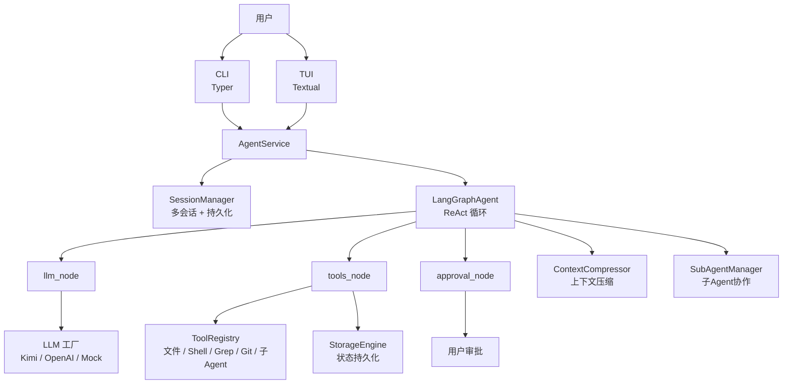
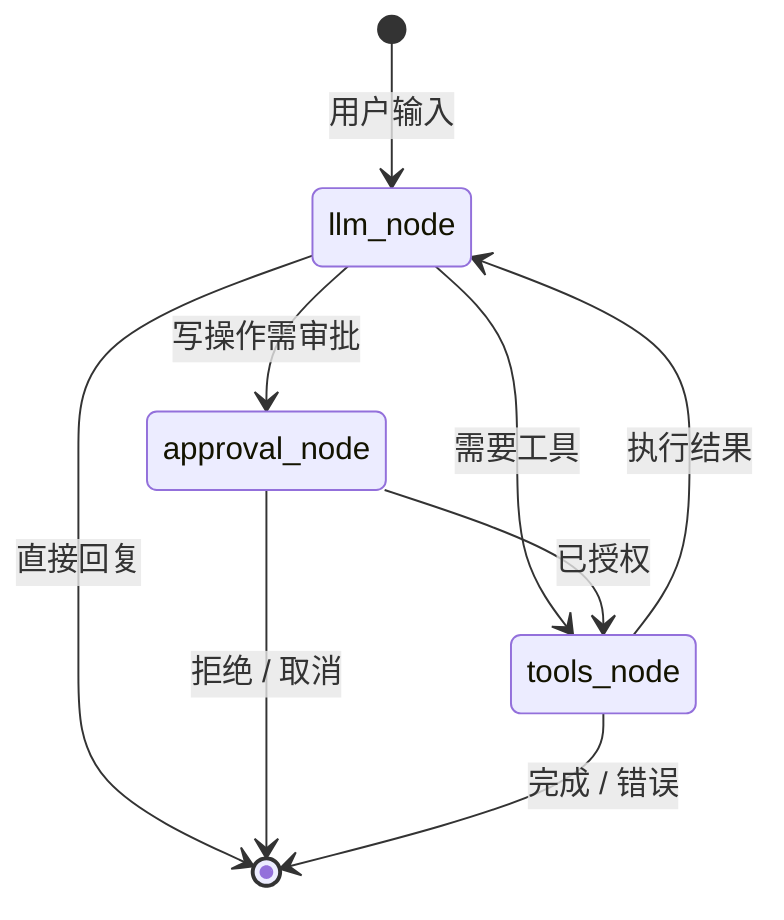

# AI Coding

[](https://github.com/XianqingLin/ai-coding-project/actions)
[](https://codecov.io/gh/XianqingLin/ai-coding-project)

一个基于 AI 的**控制台交互式编程助手**，参考 [Claude Code](https://github.com/anthropropics/claude-code) 设计。

通过自然语言与 AI 对话，让它帮你读取文件、编辑代码、执行命令、回答问题。

## 功能特性

- 🤖 **ReAct Agent 架构** — AI 能思考、决策、调用工具完成任务
- ⚡ **流式输出** — AI 回复逐字实时显示，无需等待
- 🛠️ **工具系统** — 读取/写入/编辑文件、列出目录、执行命令、代码搜索、Git 操作
- 🎨 **语法高亮** — 代码块自动高亮显示
- 📝 **日志记录** — 自动记录操作日志到 `logs/` 目录
- 🔌 **多模型支持** — 支持 Kimi (K2.6)、OpenAI、Mock 模式

## 项目亮点

| 指标 | 数据 |
|------|------|
| 单元测试 | **370+** 用例，覆盖率 **84%** |
| 内置 Benchmark | **9** 个可量化任务（fibonacci / tetris / 5 个 architecture-stress） |
| 工具数量 | **24** 个内置工具 |
| 模型支持 | Kimi / OpenAI / Mock 三种 Provider |
| 架构 | LangGraph ReAct + 审批门控 + 工作目录边界校验 + 上下文压缩 |
| 界面 | CLI + Textual 全屏 TUI |

> 所有代码均通过 `black` / `isort` / `flake8` / `mypy` 检查，CI 在 Python 3.10/3.11/3.12 上全绿运行。

## 架构设计

### 系统架构总览



### LangGraph 状态机



### 核心模块职责

| 模块 | 文件 | 职责 |
|---|---|---|
| **CLI / TUI** | `cli.py` / `tui/` | 用户交互入口，支持命令行与全屏终端界面 |
| **AgentService** | `agent/service.py` | 对外统一服务接口，管理会话、消息、状态 |
| **LangGraphAgent** | `agent/core.py` | 构建并运行 ReAct 状态图，协调 LLM、工具、审批节点 |
| **图节点** | `agent/nodes/` | `llm_node` 调用模型，`tools_node` 执行工具，`approval_node` 进行权限审批 |
| **工具系统** | `tools/` | 文件读写、Shell 执行、代码搜索、Git 操作、子 Agent 委派等 |
| **LLM 工厂** | `llm/` | 封装 Kimi / OpenAI / Mock 三种模型 provider |
| **持久化** | `persistence/` | AgentState、消息历史、执行记录的序列化与存储 |
| **上下文压缩** | `agent/context_compressor.py` | 长对话时自动压缩上下文，控制 Token 开销 |
| **子 Agent** | `agent/sub_agent_manager.py` | 支持 coder/explore/plan 角色与前后台任务委派 |

### 安全机制

- **工作目录边界校验**：所有文件操作通过 `tools/safety/path_safety.py` 校验，禁止越界访问
- **命令安全校验**：Shell 工具在执行前经过 `tools/safety/shell_safety.py` 静态分析，默认拦截 `rm -rf /`、`sudo`、`curl | bash`、`cd ..`、写入系统目录等高危模式
- **审批门控**：写操作必须经 `approval_node` 授权，支持 CLI/TUI 交互确认
- **环境隔离**：每个会话独立工作目录，持久化数据按会话隔离存储

## 快速开始

### 环境要求

- Python >= 3.10

### 安装

```bash
# 克隆仓库
git clone https://github.com/yourusername/ai-coding.git
cd ai-coding

# 创建虚拟环境
python -m venv venv

# Windows
venv\Scripts\activate

# macOS/Linux
source venv/bin/activate

# 安装依赖（推荐 editable 模式）
pip install -e .
```

### 配置

复制 `.env.example` 为 `.env`，填入你的 API Key：

```bash
cp .env.example .env
```

编辑 `.env`：

```env
# Kimi (月之暗面) — 推荐
KIMI_API_KEY=your_kimi_api_key_here
KIMI_BASE_URL=https://api.moonshot.cn/v1
KIMI_MODEL=kimi-k2.6

# 默认使用的 LLM 提供商: kimi | openai | mock
DEFAULT_LLM_PROVIDER=kimi
```

> 获取 API Key：https://platform.moonshot.cn/

### 运行

```bash
# Windows
$env:PYTHONIOENCODING="utf-8"
$env:PYTHONPATH="src"
python -m ai_coding

# 或简写
PYTHONIOENCODING=utf-8 PYTHONPATH=src python -m ai_coding
```

启动后你会看到：

```
[信息] 使用 LLM 提供商: kimi
[信息] 模型: kimi-k2.6
+------------------------------------+
|     AI Coding Assistant            |
+------------------------------------+
|  输入内容开始对话                  |
|  /help 查看命令  /exit 退出        |
+------------------------------------+
>>> 帮我查看 README.md
[Agent 思考中...]
README.md 的内容如下：
# AI Coding
...
```

## 使用示例

### 查看文件

```
>>> 帮我查看 src/main.py 的内容
```

### 列出目录

```
>>> 列出当前目录结构
```

### 执行命令

```
>>> 运行 pytest 测试
```

### 编辑文件

```
>>> 把 README.md 中的 "Python >= 3.10" 改成 "Python >= 3.11"
```

### 端到端 Demo：让 Agent 给俄罗斯方块加 Hold 功能

下面演示如何让 AI Coding 在真实代码库上完成需求分析、代码修改和测试验证。

**任务**：给 `examples/tetris/tetris.py` 添加经典的 **Hold（暂存）方块** 功能，并更新测试脚本验证。

**运行命令**：

```bash
cd examples/tetris
PYTHONIOENCODING=utf-8 python -m ai_coding ask \
  "给 tetris.py 添加一个 Hold（暂存）方块功能：按 C 键把当前方块暂存起来，再次按 C 键与已暂存的方块交换。首次暂存时直接生成下一个方块。在右侧信息区显示当前暂存的方块。更新 run_tetris_test.py 添加对 Hold 功能的测试。" \
  --work-dir . --auto-approve
```

**Agent 自动完成的工作**：

1. 读取 `examples/tetris/tetris.py` 和 `examples/tetris/run_tetris_test.py` 分析代码结构
2. 在 `TetrisGame` 中新增 `hold_piece_name` 和 `can_hold` 状态
3. 实现 `hold_piece()` 方法，处理首次暂存、交换暂存、锁定后重置等逻辑
4. 在 `run()` 主循环中监听 `C`/`c` 键
5. 在右侧信息区渲染当前暂存方块
6. 更新帮助提示，添加 `C    暂存/交换`
7. 在 `run_tetris_test.py` 中新增 4 项 Hold 功能测试
8. 运行测试脚本验证全部通过

**验证结果**：

```
[PASS] tetris.py 语法编译通过
[PASS] 方块移动逻辑正常
[PASS] 方块旋转逻辑正常
[PASS] 边界碰撞检测正常
[PASS] 消行逻辑正常
[PASS] 所有7种方块均包含4格
[PASS] 核心循环模拟完成
[PASS] 首次暂存功能正常
[PASS] 连续暂存被正确阻止
[PASS] 交换暂存功能正常
[PASS] 游戏结束/暂停时无法暂存

结论: tetris.py 核心逻辑验证全部通过
```

> 💡 该 Demo 使用真实 LLM API 运行。如果你想离线复现，可以切换到 Mock 模式，但复杂多步修改建议使用 Kimi/OpenAI 以获得更稳定效果。

### 内置命令

| 命令 | 功能 |
|------|------|
| `/help` | 显示帮助信息 |
| `/prompt` | 显示当前系统提示 |
| `/history` | 查看对话历史 |
| `/session list` | 列出所有会话 |
| `/session switch ID` | 切换会话 |
| `/session rm ID` | 删除会话 |
| `/session rename ID NAME` | 重命名会话 |
| `/new` | 创建新会话 |
| `/clear` | 清屏 |
| `/exit` | 退出程序 |

## 项目结构

```
ai-coding/
├── logs/                   # 自动生成的日志文件
├── data/                   # 会话持久化数据
├── scripts/                # 评估与辅助脚本
├── tests/                  # 单元测试
├── src/
│   └── ai_coding/
│       ├── __init__.py     # 包入口
│       ├── __main__.py     # python -m ai_coding
│       ├── cli.py          # 命令行入口
│       ├── config.py       # 环境变量配置
│       ├── logger.py       # 日志系统
│       ├── mock_llm.py     # Mock LLM（离线测试）
│       ├── agent/          # Agent 核心
│       │   ├── core.py         # LangGraph ReAct Agent 运行时
│       │   ├── service.py      # Agent 统一服务接口
│       │   ├── events.py       # 标准事件类型
│       │   ├── session.py      # 多会话管理
│       │   ├── state.py        # AgentState 定义
│       │   ├── context_compressor.py  # 上下文压缩
│       │   ├── sub_agent_manager.py   # 子 Agent 管理
│       │   └── nodes/          # 图节点（llm、tools、approval、edges）
│       ├── llm/            # LLM 封装
│       │   ├── kimi_chat.py    # KimiChatOpenAI（支持 reasoning_content）
│       │   └── lc_llm.py       # LLM 工厂（Kimi/OpenAI/Mock）
│       ├── persistence/    # 持久化存储
│       │   ├── storage.py      # 存储引擎
│       │   ├── serializer.py   # 状态序列化
│       │   └── config.py       # 存储配置
│       ├── prompts/        # 系统提示模板
│       └── tools/          # 工具系统
│           ├── base.py         # Tool / ToolRegistry
│           ├── safety/         # 安全基础设施
│           │   ├── path_safety.py  # 工作目录边界校验
│           │   └── shell_safety.py # Shell 命令安全校验
│           ├── file_tools.py   # 文件操作（read/write/edit/grep/glob/list_dir）
│           ├── shell_tools.py  # Shell 命令执行（含后台任务）
│           ├── task_tools.py   # 后台任务管理（task_list/output/stop）
│           ├── plan_tools.py   # Plan 模式工具
│           ├── collaboration_tools.py  # 协作工具
│           └── todo_tool.py    # 任务列表
├── .env                    # 环境变量（API Key 等）
├── .env.example            # 环境变量模板
├── .gitignore
├── pyproject.toml          # 项目配置
└── README.md               # 本文件
```

## 开发

### 运行测试

```bash
pytest
```

### 使用 Mock 模式（不消耗 API）

```bash
# 修改 .env
DEFAULT_LLM_PROVIDER=mock
```

### 日志位置

```
logs/ai-coding-YYYY-MM-DD.log
```

## 技术栈

| 组件 | 说明 |
|------|------|
| ReAct Agent | 推理-行动循环架构 |
| Function Calling | OpenAI 兼容的工具调用协议 |
| `openai` | LLM API 客户端 |
| `rich` | 控制台美化、Markdown/代码高亮 |
| `python-dotenv` | 环境变量管理 |
| `pytest` | 单元测试 |

## 许可证

MIT License
